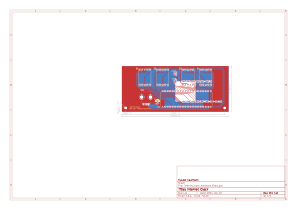
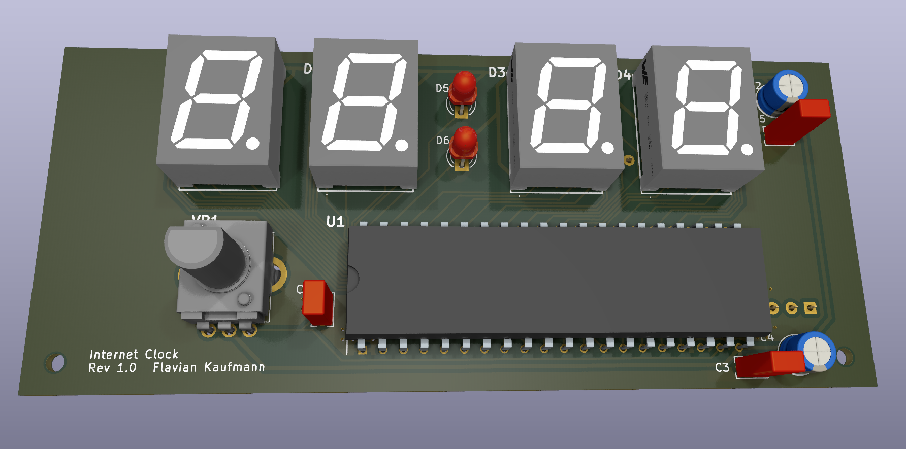
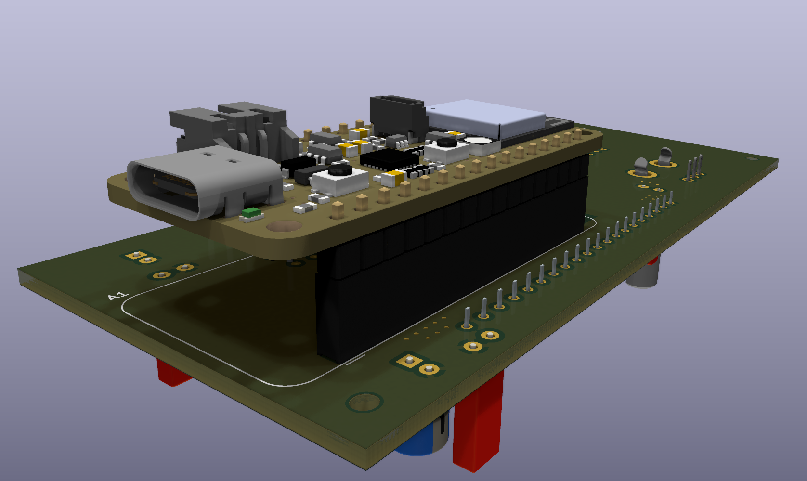
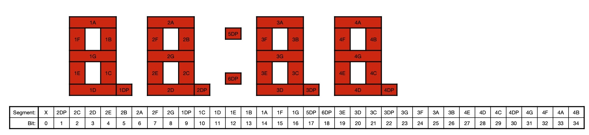
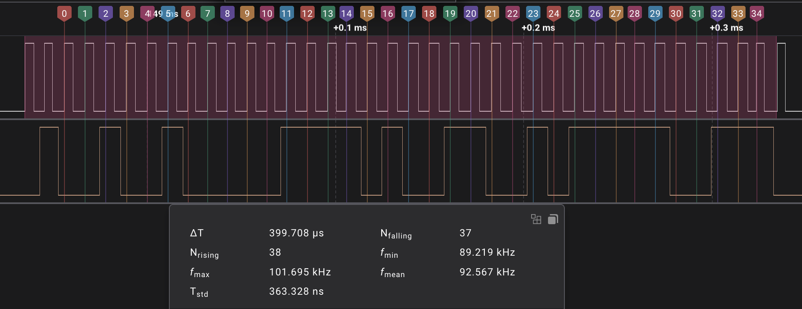

# Internet Clock

A digital clock that syncs it's time with the internet over WiFi.

## Repositories

- [Firmware](https://github.com/flavian112/internet_clock_firmware.git)
- [Hardware](https://github.com/flavian112/internet_clock_hardware.git)

## Resources

- [Feather ESP32 V2 Pinout](./datasheets/adafruit_feather_esp32_v2_pinout.pdf)
- [Feather ESP32 V2 Schematic](./datasheets/adafruit_feather_esp32_v2_schematic.png)
- [ESP32](./datasheets/espressif_esp32.pdf)
- [ESP32 Technical Reference Manual](./datasheets/espressif_esp32_technical_reference_manual.pdf)
- [ESP32 PICO](./datasheets/espressif_esp32_pico_mini_02.pdf)
- [MM5451 LED Display Driver](./datasheets/microchip_mm5450_mm5451_led_display_driver.pdf)
- [157136S12801 WL-T7DS Common Anode 7 Segment Display](./datasheets/wurth_elektronik_157136S12801_wl-t7ds_common_anode_7_segment_display.pdf)
- [PTV09-4020S-B104 Potentiometer (100k)](./datasheets/bourns_ptv09_potentiometer.pdf)

## Files

### Schematic


### Board



### 3D View




## Clock Display

The clock display is controlled by the `MM5451` chip. To turn the segments of
the display on, the chip has to be interfaced with a clock and a data line. The
chip can control up to 35 segments, 34 of which are used here. The data is
transmitted by enabling the clock (at max 500 kHz) and then signaling that the
data transmission starts by pulling the data line high for one pulse. Data
is read on the rising edge of the clock. Then the 35 bits are transmitted.
The following table shows which bit corresponds to which display segment.
Note the first bit is unused in our case.





## Usage

The clock is configured via Serial over USB at **9600 Baud**. The following
commands can be used:

- `pt` print the current datetime
- `pz` print the current timezone
- `ps` print the current ssid
- `pp` print the current password
- `sz <timezone>` sets the timezone, i.g. Europe/Zurich
- `ss <ssid>` sets the ssid
- `sp <password>` sets the password

## Time API

The time is synced with [worldtimeapi.org](http://worldtimeapi.org), the
local time can be retrieved by a GET request to `http://worldtimeapi.org/api/timezone/<timezone>`

### Example

```(json)
# curl "http://worldtimeapi.org/api/timezone/Europe/Zurich"
{
  "abbreviation": "CET",
  "client_ip": "2a01:8b81:2006:0:6d30:dc40:c29a:f48a",
  "datetime": "2024-02-03T14:22:09.924310+01:00",
  "day_of_week": 6,
  "day_of_year": 34,
  "dst": false,
  "dst_from": null,
  "dst_offset": 0,
  "dst_until": null,
  "raw_offset": 3600,
  "timezone": "Europe/Zurich",
  "unixtime": 1706966529,
  "utc_datetime": "2024-02-03T13:22:09.924310+00:00",
  "utc_offset": "+01:00",
  "week_number": 5
}
```
